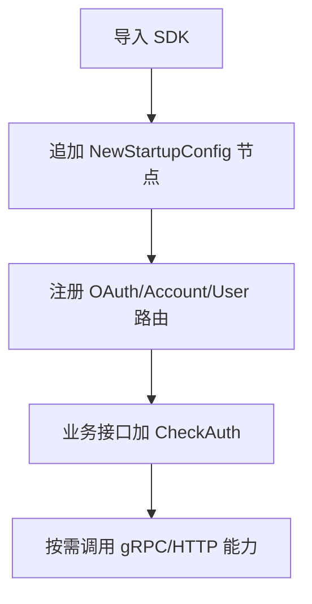

# 接入流程

本页不讲 SDK 内部实现，只讲你在项目里如何接入。

## 1. 依赖准备

在调用 `bSdkStartup.NewStartupConfig()` 前，确保你已经提供：

- `Database` 节点（`*gorm.DB`）
- `Redis` 节点（`*redis.Client`）
- `SSO_*` 环境变量（至少 OAuth2 + gRPC 关键配置）

## 2. 应用内调用顺序



## 3. 两种常见接入模式

### 模式 A: 只用登录流程（OAuth2）

```go
nodes = append(nodes, bSdkStartup.NewStartupConfig("ssoClient")...)
```

适合只需要登录、回调、登出、Token 验证的场景。

### 模式 B: OAuth2 + 账户/用户/商户接口（默认）

```go
nodes = append(nodes, bSdkStartup.NewStartupConfig()...)
```

适合要直接调用 SDK 账户和用户接口的场景。

## 4. 认证能力怎么落地

| 目标 | 用法 | 结果 |
|------|------|------|
| 某些接口匿名可访问 | 不加中间件 | 请求直接进入 Handler |
| 某些接口要求登录 | `group.Use(CheckAuth(ctx))` | 自动校验 `Authorization` |
| 在业务代码里取当前 token | `c.Get("authorization")` | 拿到已验证 Access Token |

<Callout type="info">
如果你还没接入，先看 [快速开始](./quick-start) 再回来按场景细化。
</Callout>
