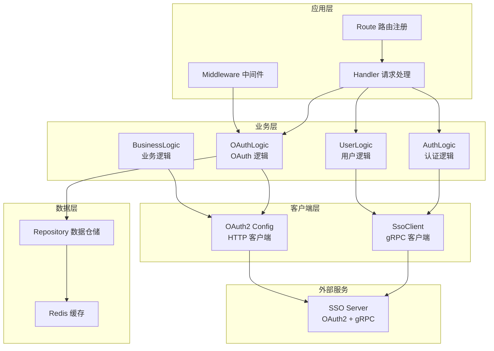
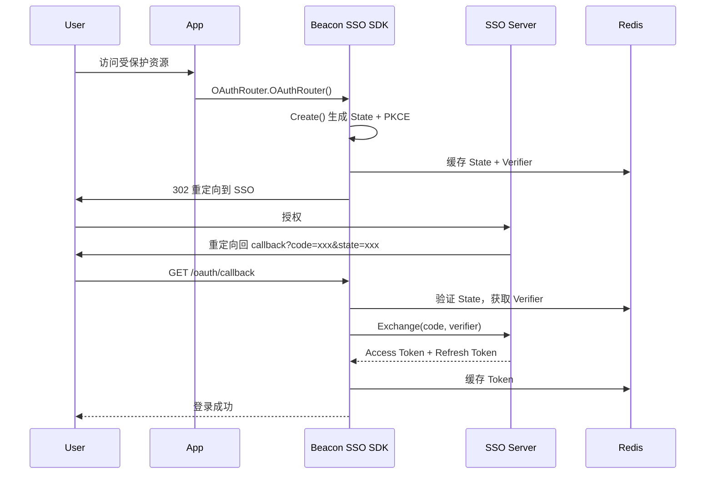

# 架构设计

Beacon SSO SDK 采用分层架构设计，与 bamboo-base-go 框架深度集成。

## 整体架构



## 依赖注入模式

SDK 采用 bamboo-base-go 的 Register 依赖注入模式：

```go
// startup/startup.go
func NewStartupConfig(exclude ...string) []xRegNode.RegNodeList
```

该函数聚合了以下注册节点：

| 节点名称 | 说明 |
|---------|------|
| `oAuthConfig` | OAuth2 核心配置（ClientID、Endpoint 等） |
| `oAuthRedirectURI` | OAuth2 重定向地址 |
| `ssoClient` | SsoClient gRPC 客户端 |

### 排除节点

你可以通过 `exclude` 参数排除特定节点：

```go
// 排除 gRPC 客户端（仅使用 OAuth2）
nodes := bSdkStartup.NewStartupConfig("ssoClient")

// 排除 OAuth 配置（使用自定义配置）
nodes := bSdkStartup.NewStartupConfig("oAuthConfig", "oAuthRedirectURI")
```

## 核心模块职责

| 模块 | 目录 | 职责 |
|------|------|------|
| **Startup** | `startup/` | 依赖注入节点定义 |
| **Route** | `route/` | Gin 路由注册 |
| **Handler** | `handler/` | HTTP 请求处理 |
| **Logic** | `logic/` | 业务逻辑封装 |
| **Client** | `client/` | gRPC 客户端 |
| **Repository** | `repository/` | 数据仓储层 |
| **Models** | `models/` | 数据模型定义 |
| **Middleware** | `middleware/` | Gin 中间件 |
| **Constant** | `constant/` | 常量定义 |
| **Utility** | `utility/` | 工具函数 |

## 两大子系统

### OAuth2 子系统

基于 `golang.org/x/oauth2` 扩展，提供：

- **授权码流程** - State + PKCE 防护
- **Token 管理** - Redis 缓存、自动刷新
- **业务能力** - Userinfo、Introspection（带缓存）



### gRPC 子系统

基于 `connectrpc.com/connect` 实现，提供：

| 服务 | 说明 | 认证要求 |
|------|------|----------|
| **Public** | 公共服务（发送验证码） | 无 |
| **Auth** | 认证服务（注册/登录/改密） | App 凭证 |
| **User** | 用户服务（获取用户信息） | App 凭证 + User Token |
| **Merchant** | 商户服务（标签/公告） | App 凭证 |

## 与 bamboo-base-go 的集成

SDK 依赖 bamboo-base-go 的以下能力：

| 能力 | 用途 |
|------|------|
| `xReg.Register` | 依赖注入容器 |
| `xCtxUtil.MustGetDB` | 从上下文获取数据库 |
| `xCtxUtil.MustGetRDB` | 从上下文获取 Redis |
| `xError` | 统一错误处理 |
| `xLog` | 结构化日志 |
| `xResult` | 统一响应格式 |

<Callout type="info">
确保你的项目已正确配置 bamboo-base-go 框架。
</Callout>
