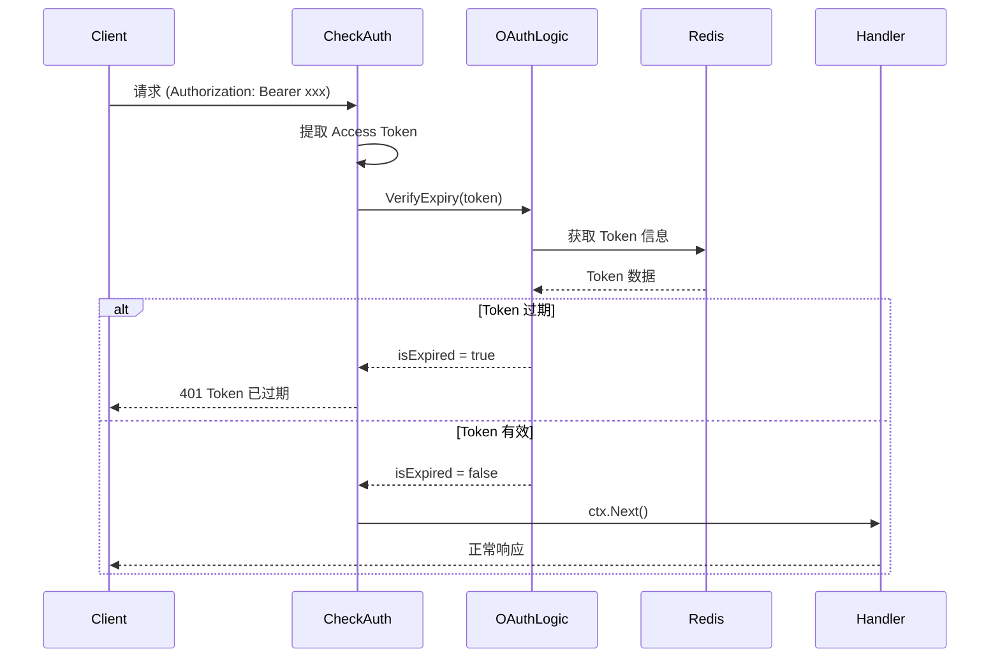

# CheckAuth 中间件

`CheckAuth` 是一个 Gin 中间件，用于验证请求中的 Access Token 是否有效。

## 功能说明

该中间件执行以下验证流程：

1. 从请求头 `Authorization` 提取 Access Token
2. 调用 `OAuthLogic.VerifyExpiry()` 验证 Token 是否过期
3. 验证通过后将 Token 存入 Gin Context
4. 验证失败则中断请求并返回错误

## 使用方法

### 函数签名

```go
func CheckAuth(ctx context.Context) gin.HandlerFunc
```

### 全局使用

```go
func main() {
    // ... 初始化代码 ...

    reg := xReg.Register(context.Background(), nodes)

    // 全局使用中间件
    reg.Serve.Use(bSdkMiddleware.CheckAuth(reg.Init.Ctx))

    // 所有路由都需要认证
    reg.Serve.GET("/api/protected", protectedHandler)
}
```

### 路由组使用

```go
func main() {
    // ... 初始化代码 ...

    reg := xReg.Register(context.Background(), nodes)

    // 公开路由
    reg.Serve.GET("/api/public", publicHandler)

    // 需要认证的路由组
    protected := reg.Serve.Group("/api")
    protected.Use(bSdkMiddleware.CheckAuth(reg.Init.Ctx))
    protected.GET("/user", userHandler)
    protected.GET("/profile", profileHandler)
}
```

### 单个路由使用

```go
reg.Serve.GET("/api/sensitive",
    bSdkMiddleware.CheckAuth(reg.Init.Ctx),
    sensitiveHandler,
)
```

## 工作流程



## 从 Context 获取 Token

中间件验证通过后，Token 会被存入 Gin Context：

```go
func protectedHandler(c *gin.Context) {
    // 获取已验证的 Access Token
    token, exists := c.Get("authorization")
    if !exists {
        c.JSON(500, gin.H{"error": "token not found"})
        return
    }

    accessToken := token.(string)
    // 使用 token 调用其他服务...
}
```

## 错误响应

| 错误码 | 说明 | HTTP 状态码 |
|--------|------|-------------|
| `ParameterEmpty` | Authorization 头缺失或为空 | 400 |
| `NotExist` | Token 在缓存中不存在 | 401 |
| `TokenExpired` | Token 已过期 | 401 |

### 错误响应示例

```json
{
  "code": 401,
  "message": "访问令牌已过期",
  "data": null
}
```

## 完整示例

```go
package main

import (
    "context"

    xConsts "github.com/bamboo-services/bamboo-base-go/defined/context"
    xReg "github.com/bamboo-services/bamboo-base-go/major/register"
    xRegNode "github.com/bamboo-services/bamboo-base-go/major/register/node"
    xResult "github.com/bamboo-services/bamboo-base-go/major/result"
    "github.com/gin-gonic/gin"
    bSdkMiddleware "github.com/phalanx-labs/beacon-sso-sdk/middleware"
    bSdkStartup "github.com/phalanx-labs/beacon-sso-sdk/startup"
)

func main() {
    nodes := []xRegNode.RegNodeList{
        {Key: xConsts.DatabaseKey, Node: initDatabase},
        {Key: xConsts.RedisClientKey, Node: initRedis},
    }
    nodes = append(nodes, bSdkStartup.NewStartupConfig()...)

    reg := xReg.Register(context.Background(), nodes)

    // 公开路由
    reg.Serve.GET("/api/health", func(c *gin.Context) {
        c.JSON(200, gin.H{"status": "ok"})
    })

    // 需要认证的路由
    protected := reg.Serve.Group("/api")
    protected.Use(bSdkMiddleware.CheckAuth(reg.Init.Ctx))

    protected.GET("/me", func(c *gin.Context) {
        token, _ := c.Get("authorization")
        xResult.SuccessHasData(c, "获取成功", gin.H{
            "token": token,
        })
    })

    _ = reg.Serve.Run(":8080")
}
```
