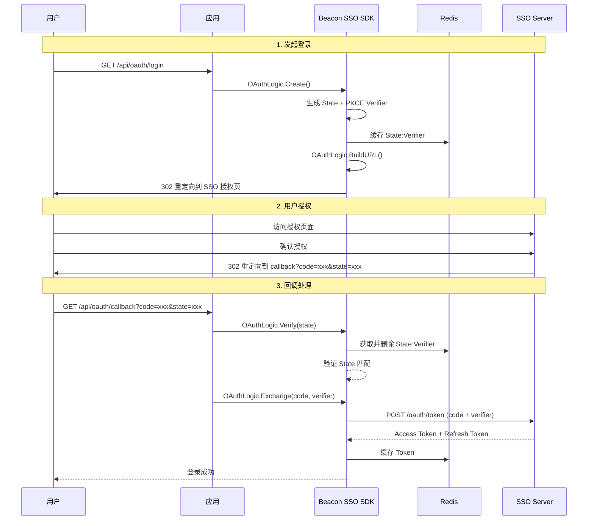

# 授权码流程

本文档详细介绍 OAuth2 授权码流程的实现细节，包括 State 防护和 PKCE 安全机制。

## 流程概览



## OAuthLogic 核心方法

### Create - 创建 State 和 PKCE

```go
func (l *OAuthLogic) Create(ctx context.Context) (*bSdkModels.CacheOAuth, *xError.Error)
```

生成随机的 State 字符串和 PKCE Code Verifier，并存储到 Redis。

**返回值：**
- `CacheOAuth.State` - 随机状态码（32 位大写字母）
- `CacheOAuth.Verifier` - PKCE Code Verifier

**缓存策略：**
- Key: `oauth:state:{state}`
- TTL: 15 分钟

### BuildURL - 构建授权 URL

```go
func (l *OAuthLogic) BuildURL(ctx context.Context, oAuth *bSdkModels.CacheOAuth) (string, *xError.Error)
```

根据 State 和 Verifier 构建完整的 OAuth2 授权跳转 URL。

**PKCE 模式：** 使用 S256（SHA-256）Challenge 方法

**生成的 URL 示例：**
```
https://sso.example.com/oauth/authorize
  ?client_id=xxx
  &redirect_uri=http://localhost:8080/api/oauth/callback
  &response_type=code
  &state=ABCD1234...
  &code_challenge=E9Melhoa2OwvFrEMTJguCHaoeK1t8URWbuGJSstw-cM
  &code_challenge_method=S256
```

### Verify - 验证 State

```go
func (l *OAuthLogic) Verify(ctx context.Context, state string) (*bSdkModels.CacheOAuth, *xError.Error)
```

从 Redis 中获取 State 对应的 PKCE Verifier，验证成功后删除缓存（防止重放攻击）。

**错误情况：**
- State 为空
- Redis 中不存在该 State
- Verifier 为空

### Exchange - 用 Code 换 Token

```go
func (l *OAuthLogic) Exchange(ctx context.Context, code string, verifier string) (*oauth2.Token, *xError.Error)
```

使用授权码和 PKCE Verifier 向 SSO Server 请求 Access Token。

**自动缓存：** 成功获取 Token 后自动缓存到 Redis

## 安全机制

### State 防护

State 参数用于防止 CSRF 攻击：

1. 用户发起登录时生成随机 State
2. 将 State 存储到 Redis
3. 回调时验证 State 是否匹配
4. 验证成功后立即删除（防重放）

### PKCE 增强

PKCE (Proof Key for Code Exchange) 防止授权码劫持：

1. 生成随机 Code Verifier
2. 计算 Code Challenge = BASE64URL(SHA256(Verifier))
3. 授权请求携带 Challenge
4. Token 请求携带 Verifier
5. 服务端验证 Verifier 与 Challenge 匹配

<Callout type="warn">
PKCE 是 OAuth2 推荐的安全增强措施，强烈建议始终启用。
</Callout>

## 直接使用 OAuthLogic

如果你需要自定义路由或处理逻辑，可以直接使用 OAuthLogic：

```go
import (
    "context"
    bSdkLogic "github.com/phalanx-labs/beacon-sso-sdk/logic"
)

func handleLogin(c *gin.Context) {
    ctx := c.Request.Context()
    oauthLogic := bSdkLogic.NewOAuth(ctx)

    // 1. 创建 State 和 PKCE
    oauth, err := oauthLogic.Create(ctx)
    if err != nil {
        // 处理错误
        return
    }

    // 2. 构建跳转 URL
    authURL, err := oauthLogic.BuildURL(ctx, oauth)
    if err != nil {
        // 处理错误
        return
    }

    // 3. 重定向
    c.Redirect(302, authURL)
}

func handleCallback(c *gin.Context) {
    ctx := c.Request.Context()
    code := c.Query("code")
    state := c.Query("state")

    oauthLogic := bSdkLogic.NewOAuth(ctx)

    // 1. 验证 State
    oauth, err := oauthLogic.Verify(ctx, state)
    if err != nil {
        // State 无效
        return
    }

    // 2. 用 Code 换 Token
    token, err := oauthLogic.Exchange(ctx, code, oauth.Verifier)
    if err != nil {
        // 换取失败
        return
    }

    // 使用 token.AccessToken...
}
```
