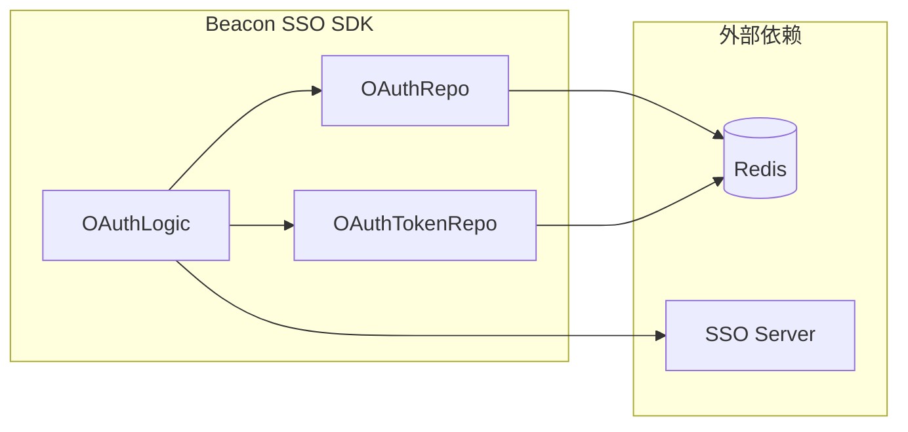

# OAuth2 子系统

OAuth2 子系统基于 `golang.org/x/oauth2` 官方库扩展，提供完整的授权码流程支持，包含 State 防护和 PKCE 安全增强。

## 核心特性

- **授权码流程** - 标准 OAuth2 Authorization Code Flow
- **State 防护** - 防止 CSRF 攻击
- **PKCE 增强** - S256 Challenge 模式，防止授权码劫持
- **Token 缓存** - 基于 Redis 的 Token 自动缓存
- **自动刷新** - 使用 Refresh Token 自动更新 Access Token

## 架构图

## 核心组件

| 组件 | 说明 |
|------|------|
| `OAuthLogic` | OAuth 业务逻辑层 |
| `OAuthRepo` | State/PKCE 数据仓储 |
| `OAuthTokenRepo` | Token 数据仓储 |

## 子文档

<CardGroup cols={2}>
  <Card title="授权码流程" href="./flow">
    了解完整的 OAuth2 授权码流程，包括 State 验证和 PKCE 机制
  </Card>
  <Card title="Token 管理" href="./token">
    了解 Token 的缓存、刷新和注销机制
  </Card>
  <Card title="默认路由" href="./routes">
    查看 SDK 提供的默认 OAuth2 路由
  </Card>
</CardGroup>
