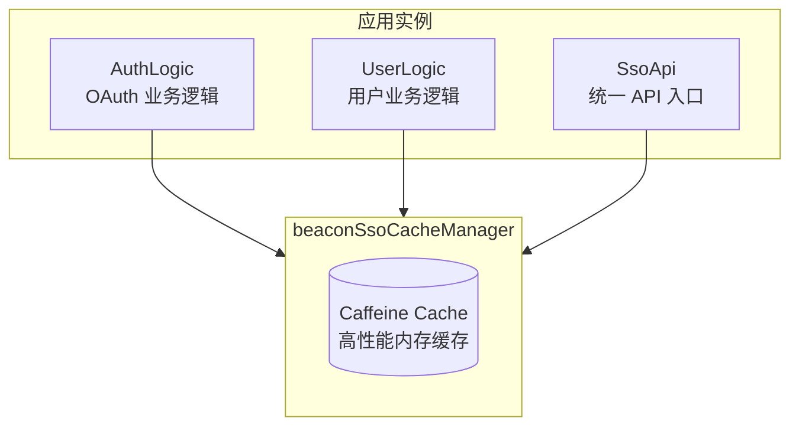

# 缓存策略

SDK 使用 Caffeine 进行高性能内存缓存，以提升性能和减少对 SSO Server 的请求。

## 缓存架构

## 缓存配置

SDK 内置 6 个缓存实例，每个缓存有不同的用途和 TTL 配置：

### 缓存列表

| 缓存名称 | 说明 | TTL | 最大容量 |
|----------|------|-----|----------|
| `oauthState` | OAuth2 State + PKCE Verifier | 15 分钟 | 10,000 |
| `grpcUserinfo` | gRPC 用户信息 | 10 秒 | 10,000 |
| `grpcMerchantTag` | 商户标签 | 10 秒 | 10,000 |
| `grpcAnnouncement` | 公告信息 | 10 秒 | 10,000 |
| `httpUserinfo` | HTTP 用户信息 | 10 秒 | 10,000 |
| `httpIntrospection` | Token 自省结果 | 10 秒 | 10,000 |

<Callout type="info">
缓存 Bean 名为 `beaconSsoCacheManager`，基于 Spring 的 `CaffeineCacheManager` 实现。所有缓存在应用重启后会自动失效。
</Callout>

## 与 Go SDK 的对比

<Callout type="warn">
Java SDK 使用 **Caffeine**（进程内内存缓存），Go SDK 使用 **Redis**（分布式缓存）。两者的缓存策略有本质区别：
</Callout>

| 对比项 | Java SDK (Caffeine) | Go SDK (Redis) |
|--------|---------------------|----------------|
| 存储位置 | JVM 进程内内存 | Redis 服务 |
| 分布式支持 | 不支持（单实例） | 支持（跨实例共享） |
| 缓存失效 | 进程重启即失效 | 基于 TTL 过期 |
| 外部依赖 | 无 | 需要 Redis |
| 数据一致性 | 各实例独立缓存 | 多实例共享同一份缓存 |

### 影响说明

- **无分布式缓存失效**：各应用实例拥有独立的缓存副本，某个实例缓存的数据变更不会自动同步到其他实例
- **适用场景**：适合单实例部署或无状态部署（如 K8s Pod），每个实例独立维护缓存
- **TTL 较短**：大部分缓存 TTL 为 10 秒，确保数据不会长期不一致

## OAuthState 实体

OAuth2 流程中用于存储 State 和 PKCE 信息的缓存实体：

| 字段 | 类型 | 说明 |
|------|------|------|
| `state` | String | 随机状态码 |
| `codeVerifier` | String | PKCE Code Verifier |
| `redirectUri` | String | 回调地址 |
| `createdAt` | Instant | 创建时间 |
| `expiresAt` | Instant | 过期时间 |

### 方法

| 方法 | 返回值 | 说明 |
|------|--------|------|
| `isExpired()` | `boolean` | 判断 OAuthState 是否已过期 |
