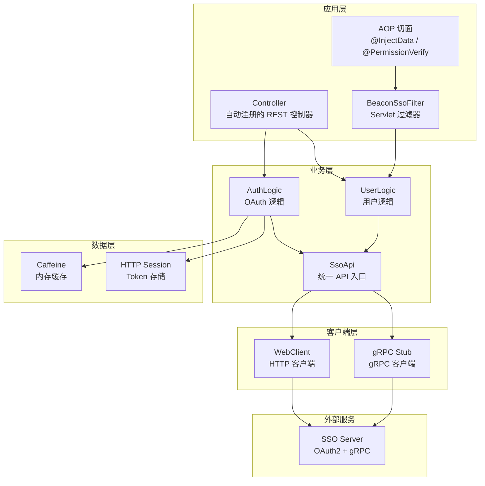
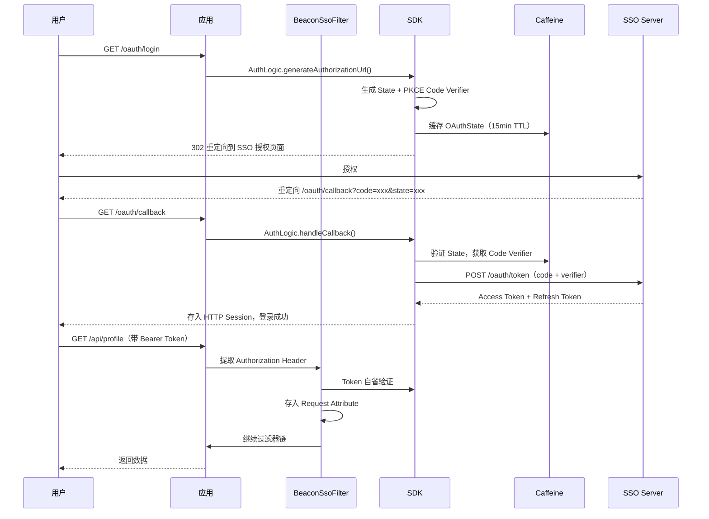

# 架构设计

Beacon SSO Java SDK 采用多模块分层架构设计，基于 Spring Boot 自动配置机制实现零侵入集成。

## 整体架构



## 多模块结构

SDK 采用 Maven 多模块设计：

| 模块 | Artifact | 说明 |
|------|----------|------|
| **bamboo-sso-base** | `bamboo-sso-base` | 核心模块：属性配置、gRPC/HTTP 客户端、数据模型、缓存、异常 |
| **bamboo-sso-sdk-springboot** | `bamboo-sso-sdk-springboot` | Spring Boot Starter：自动配置、Filter、Controller、AOP 切面 |

## Spring Boot 自动配置

SDK 通过 `META-INF/spring/org.springframework.boot.autoconfigure.AutoConfiguration.imports` 注册自动配置类：

| 配置类 | 条件 | 注册的 Bean |
|--------|------|------------|
| `AutoConfiguration` | `beacon.sso.enabled=true`（默认） | WebClient、SsoApi、CacheManager |
| `BeaconSsoSpringBootAutoConfiguration` | Servlet Web 应用 | BeaconSsoFilter、Controllers、AOP 切面 |
| `GrpcConfiguration` | `beacon.sso.grpc.enabled=true` | ManagedChannel |

<Callout type="info">
你只需引入 `bamboo-sso-sdk-springboot` 依赖并在 `application.yml` 中配置属性，所有 Bean 会自动注册到 Spring 容器中。
</Callout>

## SsoApi 统一入口

`SsoApi` 是 SDK 的核心 Facade，通过 Spring IoC 容器注入使用：

```java
@Autowired
private SsoApi ssoApi;

// 账户服务（gRPC）
ssoApi.account().registerByEmail(request);
ssoApi.account().passwordLogin(request);

// 用户服务（gRPC 优先，HTTP 回退）
ssoApi.user().getCurrentUser(accessToken, request);

// 商户服务（gRPC）
ssoApi.merchant().getMerchantTags();

// 公共服务（gRPC）
ssoApi.pub().sendRegisterEmailCode(request);
```

| 子 API | 说明 | 传输方式 |
|--------|------|----------|
| `ssoApi.account()` | 账户管理（注册/登录/改密） | gRPC |
| `ssoApi.user()` | 用户信息查询 | gRPC 优先，HTTP 回退 |
| `ssoApi.merchant()` | 商户标签/公告 | gRPC |
| `ssoApi.pub()` | 公共服务（验证码） | gRPC |

## 双传输架构

SDK 支持 HTTP 和 gRPC 两种传输方式：

| 功能 | HTTP | gRPC | 说明 |
|------|------|------|------|
| OAuth2 登录流程 | 默认 | - | 始终使用 HTTP |
| Token 自省 | 默认 | - | 始终使用 HTTP |
| 获取当前用户 | 回退 | 优先 | gRPC 启用时优先使用 |
| 按 ID 获取用户 | - | 仅 gRPC | 需启用 gRPC |
| 邮箱注册/密码登录 | - | 仅 gRPC | 需启用 gRPC |
| 商户标签/公告 | - | 仅 gRPC | 需启用 gRPC |

## OAuth2 授权流程


