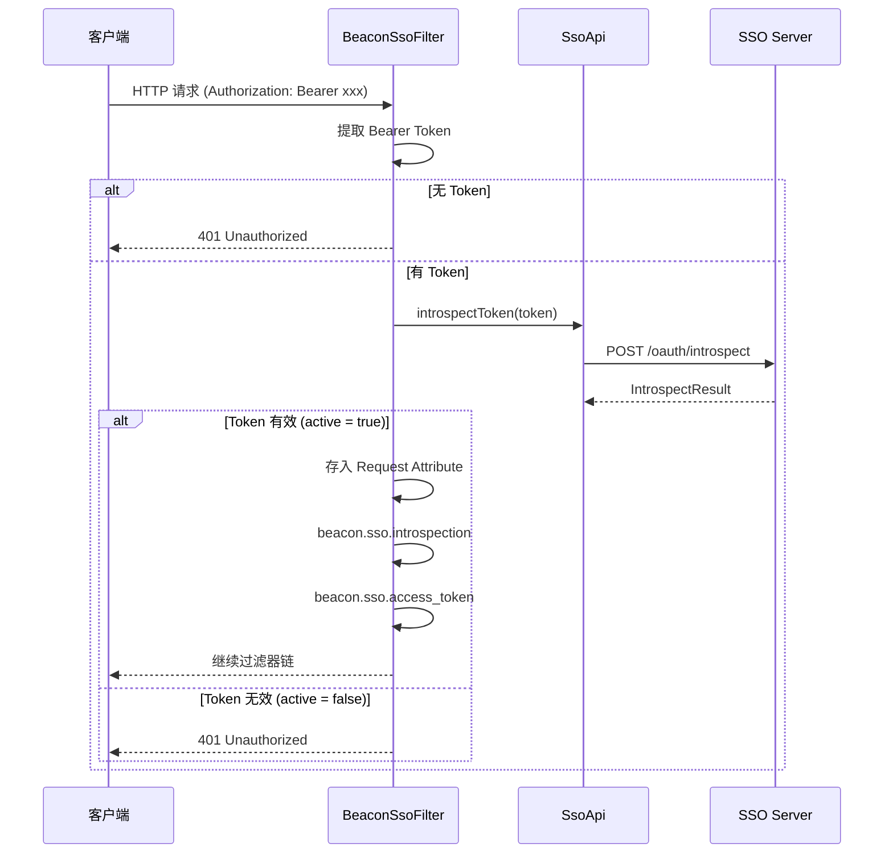

# 认证过滤器

`BeaconSsoFilter` 是 SDK 的核心过滤器，负责 Token 认证与用户信息注入。

## 工作原理

`BeaconSsoFilter` 继承 Spring 的 `OncePerRequestFilter`，在每个 HTTP 请求中执行一次 Token 认证流程：



### 认证流程说明

1. 从请求头 `Authorization` 中提取 Bearer Token
2. 调用 `SsoApi.introspectToken()` 向 SSO Server 发起 Token 自省请求
3. 若 Token 有效（`active = true`），将 `IntrospectResult` 存入请求属性 `beacon.sso.introspection`，将 Access Token 存入 `beacon.sso.access_token`，继续过滤器链
4. 若无 Token 或 Token 无效，直接返回 401 JSON 响应

## 排除路径配置

通过 `beacon.sso.exclude-urls` 配置不需要认证的路径，支持 Ant 风格路径匹配：

```yaml
beacon:
  sso:
    exclude-urls:
      - /api/public/**
      - /actuator/**
      - /health
      - /oauth/**
```

### 路径匹配规则

| 模式 | 说明 | 匹配示例 |
|------|------|----------|
| `*` | 匹配任意单层路径 | `/api/public` |
| `**` | 匹配任意多层路径 | `/api/public/v1/detail` |
| `?` | 匹配任意单个字符 | `/api/public?` |

## SsoSecurityUtil 工具类

`SsoSecurityUtil` 提供静态方法，用于从 `HttpServletRequest` 属性中获取认证信息：

### 方法列表

| 方法 | 返回值 | 说明 |
|------|--------|------|
| `SsoSecurityUtil.getCurrentToken(request)` | `Optional<String>` | 获取当前请求的 Access Token |
| `SsoSecurityUtil.getCurrentIntrospection(request)` | `Optional<IntrospectResult>` | 获取当前请求的 Token 自省结果 |
| `SsoSecurityUtil.isAuthenticated(request)` | `boolean` | 判断当前请求是否已认证 |
| `SsoSecurityUtil.hasPermission(request, permission)` | `boolean` | 判断当前用户是否拥有指定权限（scope） |

### 使用示例

```java
@RestController
@RequestMapping("/api")
public class DemoController {

    @GetMapping("/profile")
    public BaseResponse<String> getProfile(HttpServletRequest request) {
        // 获取当前用户 ID
        String userId = SsoSecurityUtil.getCurrentIntrospection(request)
                .map(IntrospectResult::getSub)
                .orElse(null);

        // 获取当前 Token
        String token = SsoSecurityUtil.getCurrentToken(request).orElse(null);

        // 判断是否已认证
        if (!SsoSecurityUtil.isAuthenticated(request)) {
            return BaseResponse.error(401, "未认证");
        }

        // 判断权限
        if (SsoSecurityUtil.hasPermission(request, "admin")) {
            return BaseResponse.success("管理员获取成功", userId);
        }

        return BaseResponse.success("获取成功", userId);
    }
}
```

## 错误响应

当认证失败时，`BeaconSsoFilter` 会返回如下格式的 401 JSON 响应：

| 场景 | 说明 |
|------|------|
| 无 Token | 请求头中未携带 `Authorization: Bearer xxx` |
| Token 过期 | Token 已超过有效期 |
| Token 无效 | Token 不被 SSO Server 识别或已被注销 |

### 错误响应示例

```json
{
  "code": 401,
  "message": "未登录",
  "data": null
}
```
