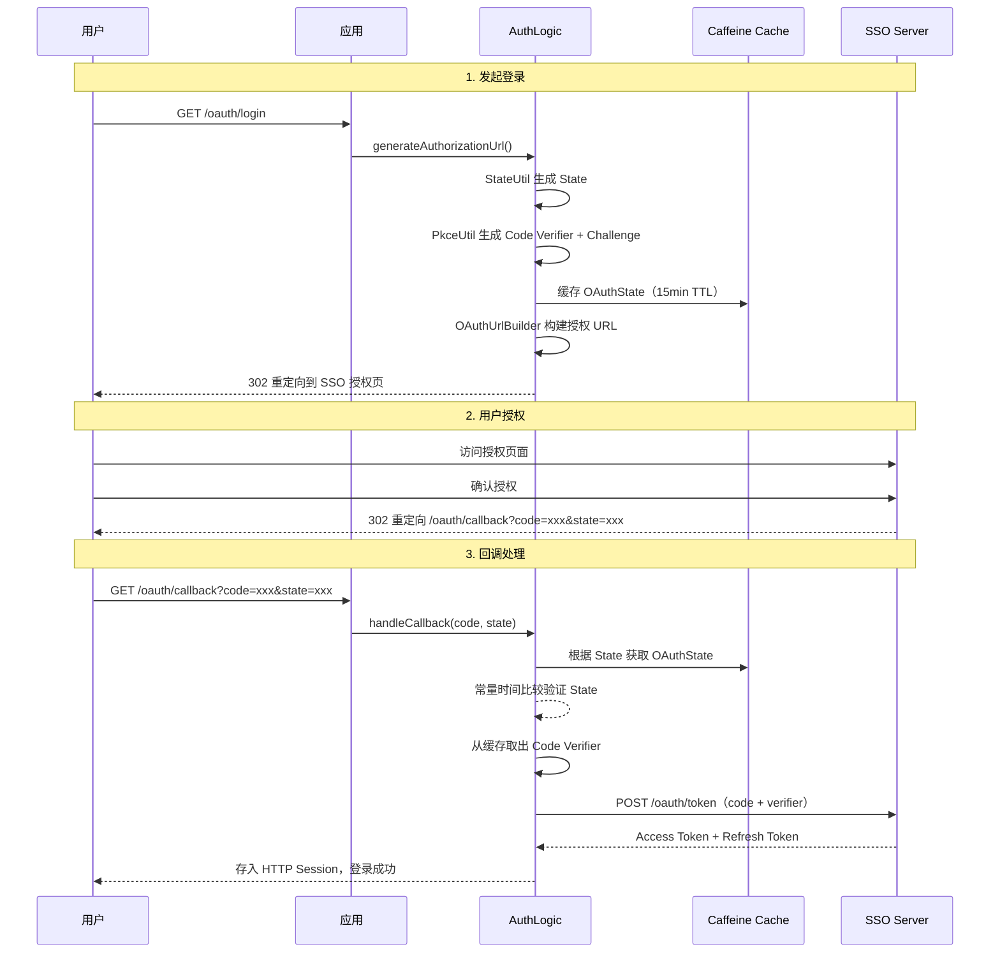

# 授权码流程

本文档详细介绍 OAuth2 授权码流程的实现细节，包括 PKCE 安全增强机制和 State 防护策略。

## 流程概览



## PKCE 安全机制

PKCE (Proof Key for Code Exchange) 用于防止授权码劫持攻击，遵循 [RFC 7636](https://tools.ietf.org/html/rfc7636) 规范。

### Code Verifier

- 长度为 **43 字符**的随机字符串
- 使用 Base64url 编码（无填充）
- 由 `PkceUtil` 自动生成

### Code Challenge

- 计算方式：`BASE64URL(SHA256(code_verifier))`
- 方法标识：`S256`
- 随授权请求一同发送至 SSO Server

### 验证流程

1. 登录时生成 `code_verifier` 并计算 `code_challenge`
2. 授权请求携带 `code_challenge` + `code_challenge_method=S256`
3. 回调时使用 `code_verifier` 向 SSO Server 交换 Token
4. SSO Server 验证 `verifier` 与 `challenge` 匹配

<Callout type="warn">
PKCE 是 OAuth2 推荐的安全增强措施，强烈建议始终启用。Java SDK 默认启用 PKCE。
</Callout>

## State 管理

State 参数用于防止 CSRF 攻击：

| 特性 | 说明 |
|------|------|
| 生成方式 | `StateUtil` 基于 `SecureRandom` 生成 |
| 存储位置 | Caffeine 内存缓存 |
| 缓存 TTL | 15 分钟 |
| 验证方式 | 常量时间比较（`MessageDigest.isEqual`），防止时序攻击 |
| 防重放 | 验证成功后立即从缓存中移除 |

<Callout type="info">
与 Go SDK 使用 Redis 存储不同，Java SDK 使用 Caffeine 内存缓存，无需外部依赖，适合单实例部署场景。
</Callout>

## OAuthUrlBuilder

`OAuthUrlBuilder` 负责构建各类 OAuth2 URL，所有端点路径均可通过 `beacon.sso.endpoints.*` 配置覆盖：

| 方法 | 用途 | 默认端点 |
|------|------|----------|
| 构建授权 URL | 用户登录重定向 | `/oauth/authorize` |
| 构建 Token URL | 用授权码换取 Token | `/oauth/token` |
| 构建 Logout URL | Token 注销 | `/oauth/revoke` |

**生成的授权 URL 示例：**

```
https://sso.example.com/oauth/authorize
  ?client_id=xxx
  &redirect_uri=http://localhost:8080/oauth/callback
  &response_type=code
  &state=ABCD1234...
  &code_challenge=E9Melhoa2OwvFrEMTJguCHaoeK1t8URWbuGJSstw-cM
  &code_challenge_method=S256
```

## HTTP Session Token 存储

与 Go SDK 使用 Redis 缓存 Token 不同，Java SDK 将 Token 存储在 **HTTP Session** 中：

- **存储时机**：OAuth2 回调成功后，Token 写入当前用户的 HTTP Session
- **存储内容**：`TokenResult`（access_token、refresh_token、token_type、expires_in 等）
- **读取方式**：通过 `HttpServletRequest.getSession()` 获取
- **清除时机**：用户注销（`/oauth/logout`）或 Session 过期时清除

<Callout type="info">
HTTP Session 存储是 Java SDK 的独特设计，利用 Servlet 容器内置的会话管理机制，无需引入 Redis 等外部中间件，适合单实例或无状态部署场景。
</Callout>
