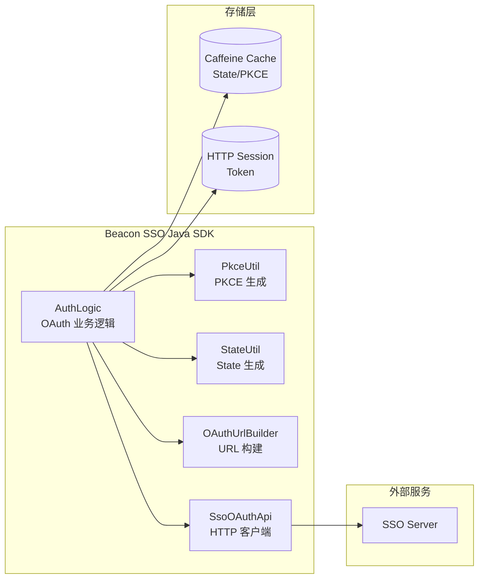

# OAuth2 子系统

OAuth2 子系统基于 Spring Boot 自动配置实现，提供完整的授权码流程支持，包含 State 防护、PKCE 安全增强和 Caffeine 高性能缓存。

## 核心特性

- **OAuth2 授权码流程** - 标准 Authorization Code Flow，集成 PKCE (S256) 安全增强
- **Caffeine State 缓存** - 基于 Caffeine 的高性能内存缓存，替代 Redis 依赖
- **HTTP Session Token 存储** - 利用 Servlet HTTP Session 存储 Token（无需外部存储）
- **Token 刷新/注销** - 支持 Refresh Token 自动刷新和 RFC 7009 标准注销
- **OAuthUrlBuilder URL 构建** - 统一的授权、Token、注销 URL 构建器

## 架构图

## 核心组件

| 组件 | 说明 |
|------|------|
| `AuthLogic` | OAuth 业务逻辑层，处理登录、回调、Token 管理等核心流程 |
| `PkceUtil` | PKCE Code Verifier / Challenge 生成工具 |
| `StateUtil` | 基于 `SecureRandom` 的 State 生成工具 |
| `OAuthUrlBuilder` | 统一构建授权 URL、Token URL、注销 URL |
| `SsoOAuthApi` | 封装 HTTP 请求，与 SSO Server 通信 |
| `Caffeine Cache` | 高性能内存缓存，存储 State + PKCE Verifier（15 分钟 TTL） |
| `HTTP Session` | Servlet 标准会话存储，用于保存 Token 信息 |

## 子文档

<CardGroup cols={3}>
  <Card title="授权码流程" href="./flow">
    了解完整的 OAuth2 授权码流程，包括 State 验证和 PKCE 安全机制
  </Card>
  <Card title="Token 管理" href="./token">
    了解 Token 的存储、刷新和注销机制
  </Card>
  <Card title="默认路由" href="./routes">
    查看 SDK 自动注册的 OAuth2 与账户路由
  </Card>
</CardGroup>
